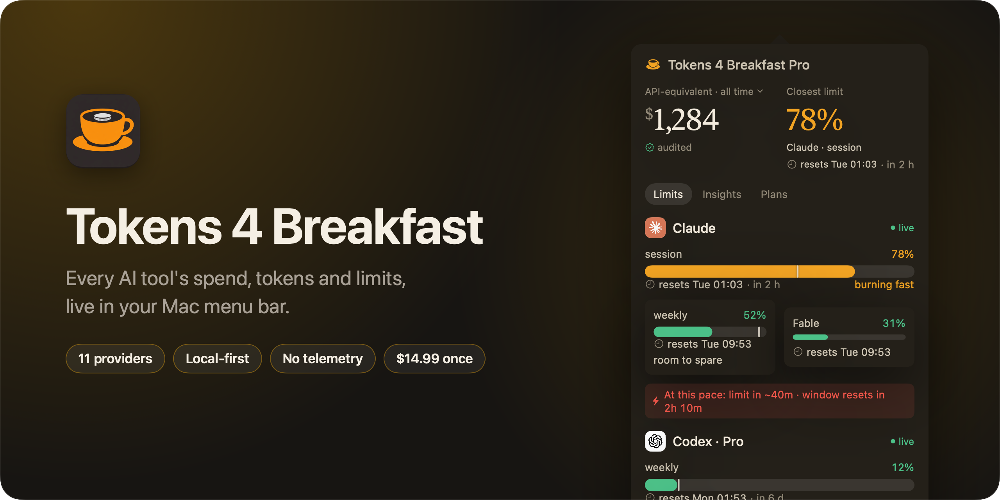
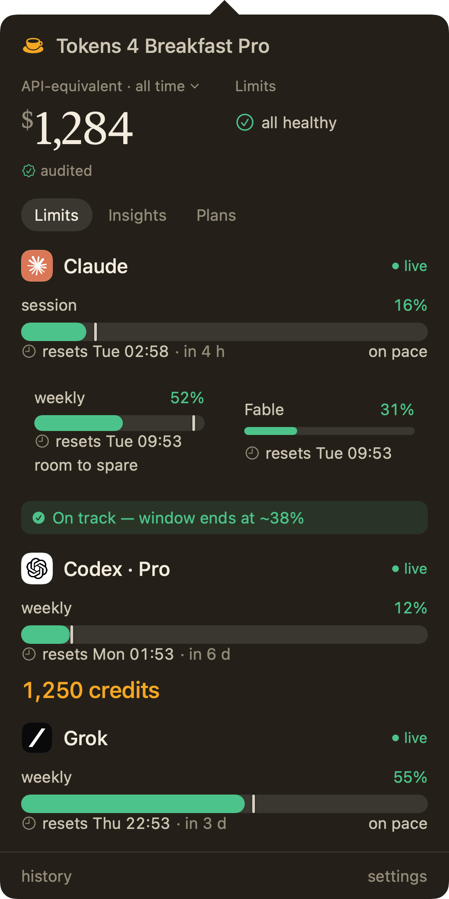
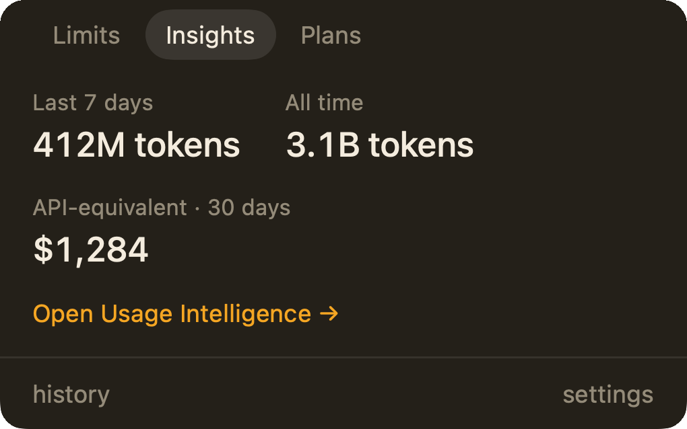
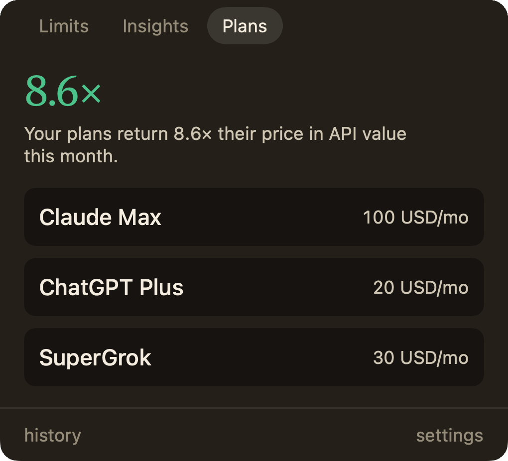
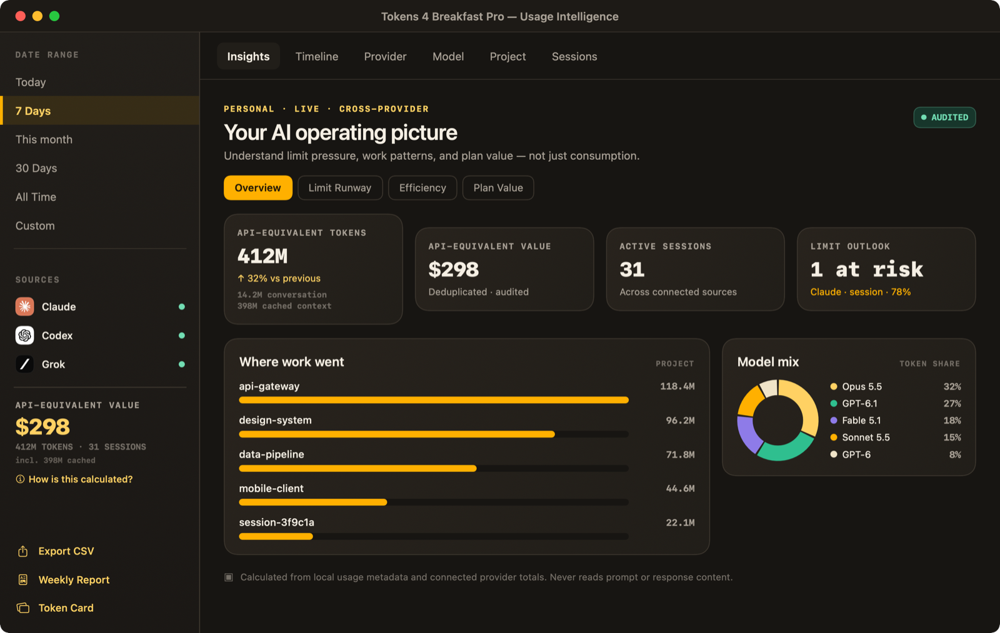
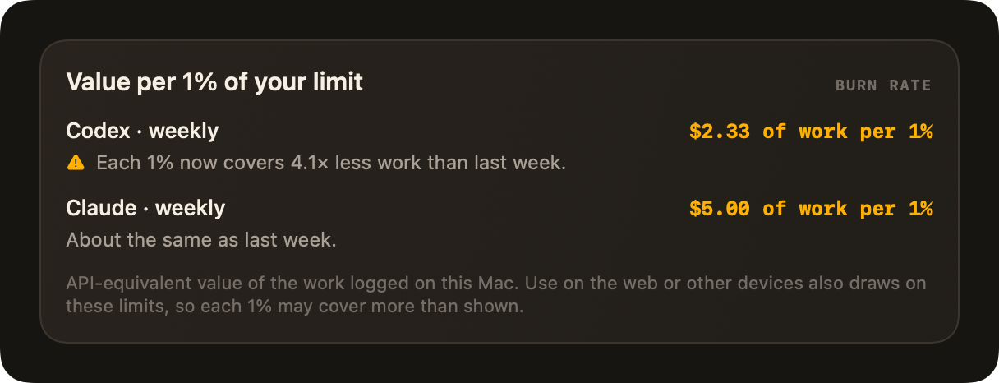
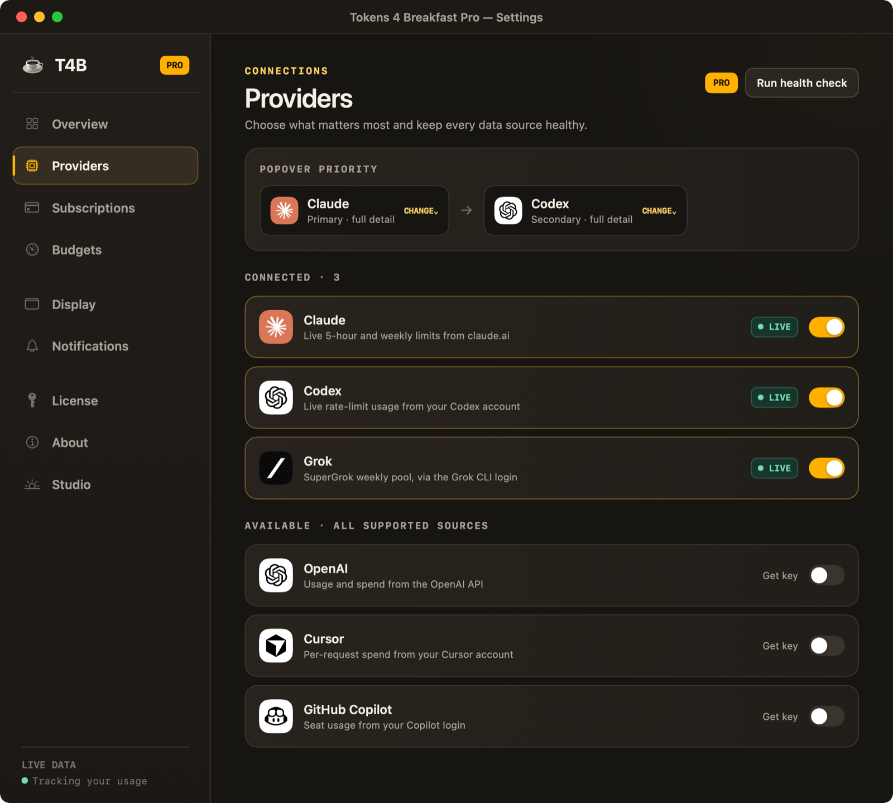
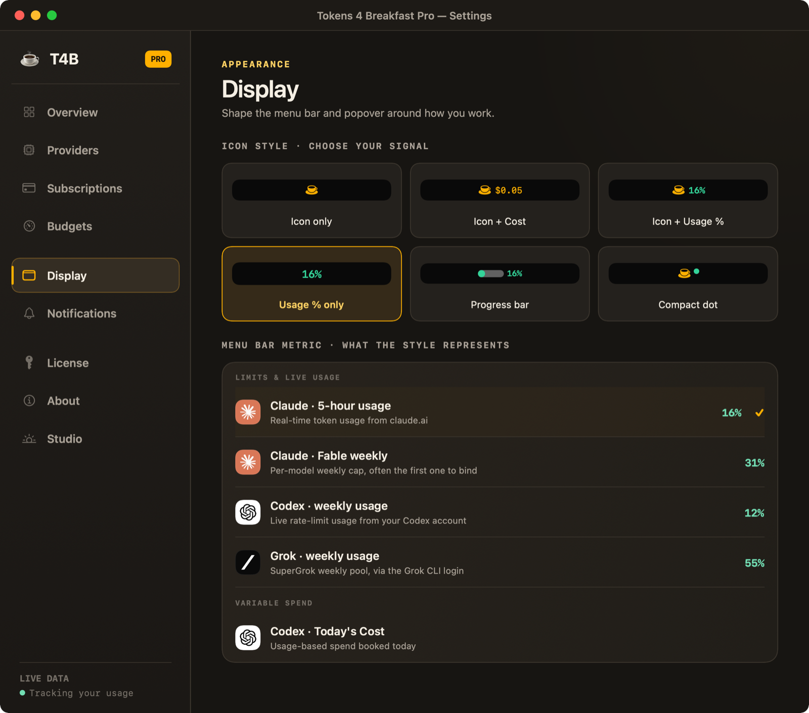
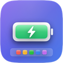
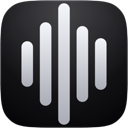

 
 

**AI spend, tokens and rate limits across 11 providers, in one private Mac menu bar app.** 
Claude Code · Claude · Codex · Cursor · GitHub Copilot · OpenAI · Anthropic API · Grok · DeepSeek · Mistral · OpenRouter

 

 

> [!NOTE]
> **Tokens 4 Breakfast is a commercial, closed-source macOS app.** This repository hosts the public docs and the issue tracker, not the source code. Bug reports and feature requests are welcome in [Issues](https://github.com/onekapisch/Tokens-4-Breakfast/issues).

## Why

If you build with AI, your spend and your limits are spread across a handful of tools, and you usually find out about either one too late:

- **The bill.** Claude, ChatGPT, Cursor, Copilot and a few API keys each bill separately, and nothing adds them up until the invoices arrive.
- **The limit.** You hit a Claude or Codex window halfway through an agent run, with no warning.

Tokens 4 Breakfast keeps both numbers in your menu bar while you work: what your usage is worth, what your subscriptions cost, and how much of each limit you have left.

## A look inside

<table>
  <tr>
    <td width="50%" valign="top">
      
      
<b>Limits.</b> Every window with its reset time, a pace marker and a forecast.

    </td>
    <td width="50%" valign="top">
      
      
<b>Insights.</b> Tokens and their API-equivalent value at a glance.

      
      
<b>Plans.</b> Whether your subscriptions pay for themselves.

    </td>
  </tr>
</table>

Screenshots are rendered from the app with sample data, not a real account.

## What you get

- **Live numbers in the menu bar.** Show a provider's cost, all-provider spend, a subscription total, a Claude 5-hour or weekly cap, or Codex and Grok usage, with up to two extra compact metrics beside it.
- **Know your pace.** Every 5-hour and weekly meter marks where an even pace would be, with one word beside it: *burning fast*, *on pace* or *room to spare*. 90% used with an hour to go reads very differently from 90% with two days left.
- **Limits before you hit them.** Claude 5-hour, weekly and per-model limits, Codex limits and the Grok weekly limit, each with a reset time and a burn-rate forecast. Claude limits alert you as you approach the cap, and a weekly cap pinned in the menu bar alerts at 80%, 95% and 100%.
- **Usage in real money.** Claude Code and Codex usage is valued at each model's published API rate, including cache reads, cache writes and Claude fast mode, so a flat subscription still shows what the same tokens would have cost. Models without a public rate are marked unpriced, never guessed.
- **Codex credits, watched.** The Codex section shows your credit balance the way Codex counts it, and tells you once when you reach your plan limit and further work starts drawing on credits.
- **Subscription tracking.** Add Claude, ChatGPT, Cursor, Copilot, Gemini, Grok, Mistral and other plans, and see them next to your usage-based spend.
- **Focus Mode.** Set a dollar budget for a work session and get warned at 80% and 100%.
- **Your currency.** Show spend in EUR, GBP and more, at a conversion rate you set.
- **Privacy Audit Log.** Every outbound request the app makes is logged in Settings, with host, reason and time.

## Usage Intelligence Pro

  

A full dashboard for heavy users: **Limit Runway** (when you will hit each cap at your current pace), **Efficiency** (where a cheaper model would do the job) and **Plan Value** (whether your plans pay for themselves), plus breakdowns by provider, model, project and session.

  

**New in 2.0.17: what 1% of your limit buys.** How much work each 1% of your weekly Claude or Codex limit covers, compared with last week, so you can see when a limit tightens.

Pro also adds per-provider daily and weekly **budgets** with alerts, **CSV export**, a weekly summary and the shareable **Token Card**.

## Settings that stay out of your way

<table>
  <tr>
    <td width="50%" valign="top">
      
      
<b>Providers.</b> Local sources connect without a key.

    </td>
    <td width="50%" valign="top">
      
      
<b>Display.</b> Choose exactly what the menu bar shows.

    </td>
  </tr>
</table>

## Supported providers

11 providers connect. 8 of them report real spend; Claude Web and Grok report live rate limits only, and DeepSeek reports an account balance, so the app shows no dollar figure for those three.

| Provider | What it reports | How it connects |
|---|---|---|
| **Claude Code** | Spend (API-equivalent), projects, models, sessions | Local session files. No key. |
| **Claude Web** | Claude 5-hour, weekly and per-model limits | Your claude.ai session, via a guided connect in Settings |
| **Cursor** | Spend, projects, models, sessions | Local Cursor data. No key. |
| **Codex** | Spend, plan limits and credits | Local Codex CLI sessions. No key. |
| **GitHub Copilot** | Subscription value and monthly quota (AI credits or premium requests, as GitHub reports it) | Your local Copilot CLI login. No key. |
| **Grok** | SuperGrok weekly limit | Your local Grok CLI login. No key. |
| **Anthropic API** | Organization API spend | Anthropic Admin API key (organizations only) |
| **OpenAI** | Organization API spend | OpenAI organization Admin API key |
| **Mistral** | Organization API spend | Mistral Enterprise Admin API key |
| **OpenRouter** | Spend, model mix, remaining credits | OpenRouter API key |
| **DeepSeek** | Account balance | DeepSeek API key |
| **Gemini** | Coming soon | Not collecting yet |

OpenAI, Anthropic API and Mistral need an organization admin key; a personal key cannot read their usage endpoints. Keys are stored in the macOS Keychain and sent only to that provider's API.

## Free vs Pro

| | Free | Pro |
|---|:---:|:---:|
| **Price** | $0, no time limit | **$14.99 one-time**, no subscription |
| Providers | 1 of your choice | All 11 |
| History | Today and 7 days | 30 days |
| Menu bar spend and limits, pace marker | ✓ | ✓ |
| Focus Mode session budgets | ✓ | ✓ |
| AI subscription tracking | ✓ | ✓ |
| Privacy Audit Log | ✓ | ✓ |
| Usage Intelligence and Value per 1% | | ✓ |
| Per-provider daily and weekly budgets | | ✓ |
| CSV export and weekly summary | | ✓ |
| Sessions tab with cost breakdown | | ✓ |
| Token Card | | ✓ |
| Priority email support | | ✓ |

Pro includes future updates. It is licensed per Mac and comes with a 14-day money-back guarantee. If you bought Pro at the $7.99 launch price, you keep everything, including future updates.

## Privacy and security

- **Local storage.** Usage lives in a SQLite database on your Mac. There is no Tokens 4 Breakfast account and no cloud backend.
- **No prompts, ever.** The app keeps usage metadata only (token counts, model, timestamp, cost). Your prompts and responses are never stored or sent anywhere.
- **No telemetry.** The only network calls go to the providers you connect, a license check when you activate Pro, and the update check. Each one appears in the Privacy Audit Log.
- **Credentials in the Keychain.** API keys and sessions are stored in the macOS Keychain and sent only to the matching provider.
- **Signed and notarized** by Apple, with the hardened runtime. Built in Germany.

See [SECURITY.md](SECURITY.md) for how to report a vulnerability.

## Install

1. **[Download the latest release](https://www.tokens4breakfast.app/download?source=github_readme).**
2. Open the .zip and drag **Tokens 4 Breakfast** to `/Applications`.
3. Launch it, click the menu bar icon, and connect a provider in Settings.

**Updating:** built-in auto-update (Sparkle). The app tells you when a new version is ready to install. 
**Uninstalling:** quit the app and move it to the Trash. Your data is in `~/Library/Application Support/Tokens4Breakfast`; saved keys are in your login Keychain under `com.onekapisch.tokensforbreakfast`. 
**Requirements:** macOS 14.6 Sonoma or later, Apple Silicon or Intel.

## Recent releases

| Version | Highlights |
|---|---|
| **2.0.17** · 4 Oct 2026 | Pace marker on every 5-hour and weekly limit, Codex credits watch, value per 1% of your limit (Pro), and Claude Opus 5.5 / Sonnet 5.5 and GPT-6.1 Sol priced |
| **2.0.16** · 19 Sep 2026 | GPT-6 and Claude Fable 5.1 priced; every model rate re-checked against the providers' official pricing pages |
| **2.0.15** · 18 Sep 2026 | Extra metrics in the menu bar, weekly-limit alerts at 80/95/100%, and a selectable period for the popover's headline figure |
| **2.0.14** | Focus sessions back in the popover, a burn-rate forecast per limit, and early-reset tracking |
| **2.0.10** | Anthropic API organization spend |
| **2.0.9** | Spend in your own currency, the standalone Copilot CLI, and Codex per-model limits |
| **2.0.6** | Grok / SuperGrok weekly limit |

Full notes for each version appear in the app's What's New sheet.

## How it compares

[ccusage](https://www.tokens4breakfast.app/alternatives/ccusage-gui) is a command-line tool for local agent usage and costs; Tokens 4 Breakfast puts that kind of visibility in a native menu bar app and adds subscriptions, budgets and more providers. [CodexBar](https://www.tokens4breakfast.app/alternatives/codexbar-alternative) is a free, open-source menu bar tracker for coding-provider limits; Tokens 4 Breakfast also tracks spend, subscriptions and budgets around those limits. More side-by-side pages: [tokens4breakfast.app/alternatives](https://www.tokens4breakfast.app/alternatives).

## FAQ

<b>Is it open source?</b>

 
No, it is a commercial app. This repo holds the docs and the issue tracker.

<b>Does it read my prompts?</b>

 
No. It keeps token counts, model names, timestamps and cost, never conversation content.

<b>Does it send my data anywhere?</b>

 
No telemetry. It only calls the providers you connect, plus the Pro license check and the update check.

<b>Why is there no dollar figure for Claude Web, Grok or DeepSeek?</b>

 
Those providers report limits or a balance, not spend, and the app does not invent one.

<b>What about Gemini?</b>

 
Google does not currently expose the account usage data the app needs, so Gemini stays disabled until it does.

<b>Can I use Pro on more than one Mac?</b>

 
Pro is licensed per Mac. The free plan has no device limit.

More answers in the **[full FAQ](https://www.tokens4breakfast.app/faq)**.

## Roadmap and feedback

The roadmap follows what users ask for. Want a provider or a feature? **[Open an issue](https://github.com/onekapisch/Tokens-4-Breakfast/issues/new/choose).** Many recent features, including the pace marker and the multi-metric menu bar, started as requests.

## More from OneKapisch

Other apps from the same studio, [onekapisch.com](https://www.onekapisch.com):

<table>
  <tr>
    <td align="center" valign="top" width="16%"><a href="https://www.mac4breakfast.app/"> <b>Mac 4 Breakfast</b></a> Your one battery app that does it all.</td>
    <td align="center" valign="top" width="16%"><a href="https://getlumel.app/"> <b>LUMEL</b></a> Brighter than macOS allows. Darker than its minimum.</td>
    <td align="center" valign="top" width="16%"><a href="https://clip4breakfast.app/"> <b>Clip 4 Breakfast</b></a> The clipboard manager that never slows your Mac down.</td>
    <td align="center" valign="top" width="16%"><a href="https://github.com/onekapisch/chime-4-breakfast"> <b>Chime 4 Breakfast</b></a> Run-completion alerts. Open source.</td>
    <td align="center" valign="top" width="16%"><a href="https://github.com/onekapisch/easy-write"> <b>Easy Write</b></a> On-device writing tools. Open source.</td>
    <td align="center" valign="top" width="16%"><a href="https://www.skylocation.app/"> <b>SkyLocation</b></a> Know where you are. Without internet or signal.</td>
  </tr>
</table>

 

**If Tokens 4 Breakfast is useful to you, a ⭐ helps other builders find it.**

[Website](https://www.tokens4breakfast.app) · [Download](https://www.tokens4breakfast.app/download?source=github_readme) · [FAQ](https://www.tokens4breakfast.app/faq) · [Privacy](https://www.tokens4breakfast.app/privacy)

Built in Germany by <a href="https://www.onekapisch.com">OneKapisch</a>.

